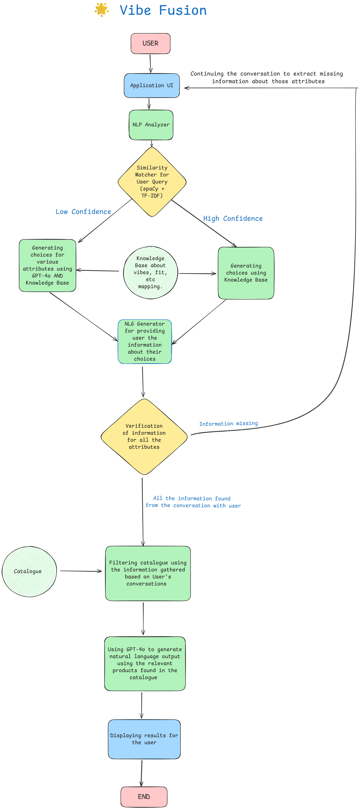

# 🌟 Vibe Fusion

AI-powered fashion recommendation system that transforms natural language style descriptions into personalized outfit suggestions. The system combines rule-based matching, semantic similarity, and GPT-powered inference to understand user "vibes" and translate them into actionable product recommendations.

## ✨ Key Features & Innovations

### 🧠 **Hybrid Intelligence Architecture**
- **Rule-based + AI hybrid**: Combines fast, reliable rule-based matching with intelligent GPT fallback
- **Confidence-aware processing**: Automatically determines when to use GPT vs rule-based matching
- **Semantic understanding**: Uses spaCy word vectors and TF-IDF for contextual phrase matching
- **Knowledge base approach**: Curated vibe-to-attribute JSON mappings for fashion domain expertise

### 💬 **Conversational Interface**
- **Multi-turn conversations**: Maintains context across multiple user interactions
- **Smart follow-up questions**: Automatically asks for missing critical attributes
- **Natural language processing**: Handles complex queries like "something elegant for a dinner date"
- **Context preservation**: Remembers user preferences and partial requirements throughout the session
- **Intelligent state management**: Tracks conversation history, pending attributes, and user preferences
- **Progressive refinement**: Each interaction builds upon previous context for better recommendations
- **Graceful conversation reset**: Users can start fresh while preserving useful context

### 🎯 **Advanced Query Understanding**
- **Compound phrase recognition**: Understands "summer brunch" as season+occasion combination
- **Fashion-specific NLP**: Specialized entity extraction for clothing categories, fits, occasions
- **Fuzzy matching**: "comfy" automatically maps to "comfortable" and "relaxed"
- **Multi-modal attributes**: Processes style, season, occasion, fit, color, and occasion simultaneously

### 📊 **Intelligent Product Filtering**
- **Multi-criteria search**: Filters by category, price, size, fit, fabric, color, occasion
- **Category-aware validation**: Different attributes are relevant for tops vs dresses vs pants
- **Flexible size handling**: Supports both traditional (S/M/L) and numeric sizing
- **Smart price context**: Provides value context based on user budget

### 🎨 **Design & User Experience**
- **Intuitive conversational interface**: Natural chat-based interaction with visual feedback
- **Progressive disclosure**: Information revealed step-by-step to avoid overwhelming users
- **Visual product showcase**: Rich product displays with images and detailed descriptions
- **Responsive design**: Optimized for desktop, tablet, and mobile experiences
- **Accessibility features**: Screen reader support, keyboard navigation, high contrast options

## 🏗️ **System Architecture & Design Decisions**

### **Modular Pipeline Design**

The system follows a sophisticated pipeline architecture that processes user queries through multiple specialized stages:

```
User Query → NLP Analysis → Similarity Matching → GPT Inference → Product Filtering → NLG Response
```

### **1. NLP Analyzer (`modules/nlp_analyzer.py`)**

**Design Decision**: Hybrid spaCy + NLTK approach
- **Why chosen**: spaCy provides excellent tokenization and entity recognition, while NLTK offers robust stopword filtering
- **Benefits over alternatives**: More accurate than pure regex, faster than full transformer models
- **Fashion-specific patterns**: Curated lists of occasions, styles, fits, colors specific to fashion domain
- **Compound phrase detection**: Recognizes multi-word fashion concepts like "summer brunch"

**Key Features**:
- Fashion-specific entity patterns for occasions, seasons, styles, categories, fits
- Intelligent text cleaning that preserves fashion terminology
- Confidence scoring for extracted attributes
- Budget extraction with currency normalization

### **2. Similarity Matcher (`modules/similarity_matcher.py`)**

**Design Decision**: Dual similarity approach (spaCy + TF-IDF)
- **Why chosen**: spaCy provides semantic understanding, TF-IDF provides robust string matching
- **Benefits**: Handles both exact matches ("bodycon") and semantic matches ("form-fitting" → "bodycon")
- **Knowledge base approach**: JSON mappings allow easy updates without retraining models

**Vibe-to-Attribute Mappings**:
- `fit_mapping.json`: 20+ fit descriptors → standardized fit attributes
- `color_mapping.json`: Color families and style descriptors → specific color palettes  
- `occasion_mapping.json`: 25+ complex occasion scenarios with full attribute sets
- `fabric_mapping.json`: Fabric types and characteristics

**Confidence-based Processing**:
- Similarity threshold (default 0.8) determines when to trust rule-based matches
- High confidence matches skip GPT inference for speed
- Low confidence triggers GPT fallback for better coverage

### **3. GPT Inference (`modules/gpt_inference.py`)**

**Design Decision**: GPT-4 as intelligent fallback, not primary engine
- **Why chosen**: GPT provides broad coverage but is slower and requires API calls
- **Benefits**: Handles edge cases and complex queries that rule-based matching misses
- **Structured output**: Enforces JSON schema with validation against known valid values
- **Graceful degradation**: System works without GPT, just with reduced functionality

**Smart Prompting Strategy**:
- Category-aware attribute validation (tops have different attributes than dresses)
- Extensive valid value lists prevent hallucination
- Context injection from existing rule-based matches
- Temperature 0.3 for consistent, focused responses

### **4. Catalog Filter (`modules/catalog_filter.py`)**

**Design Decision**: Pandas-based flexible filtering with category awareness
- **Why chosen**: Fast filtering on structured data, easy to extend with new criteria
- **Benefits**: Supports complex multi-criteria searches with partial matching
- **Category-specific logic**: Different filtering rules for tops, dresses, skirts, pants

**Advanced Filtering Features**:
- **Color family matching**: "pastels" expands to multiple specific colors
- **Size compatibility**: Flexible size matching across different size systems
- **Fabric lists**: Handles multiple fabric preferences (["silk", "satin"])
- **Price context awareness**: Sorts and prioritizes based on budget constraints

### **5. NLG Generator (`modules/nlg_generator.py`)**

**Design Decision**: Template-based generation with contextual adaptation
- **Why chosen**: More reliable and controllable than pure generative models
- **Benefits**: Consistent tone, factual accuracy, domain-appropriate language
- **Context-aware**: Different response styles for single vs multiple products

## 🎯 **Why This Architecture? Benefits Over Alternatives**

### **Hybrid Approach vs Pure AI/Pure Rules**
- **Pure rule-based systems**: Limited to predefined patterns, can't handle edge cases
- **Pure AI systems**: Expensive, unpredictable, require constant fine-tuning
- **Our hybrid approach**: Fast rule-based for common cases + AI for complexity = best of both worlds

### **Knowledge Base vs End-to-End Learning**
- **End-to-end neural models**: Require massive training data, black box decisions
- **Our curated knowledge base**: Transparent, easily updatable, leverages human expertise
- **Benefits**: Explainable recommendations, easy maintenance, domain expert friendly

### **Modular vs Monolithic Design**
- **Monolithic systems**: Hard to debug, upgrade, or customize
- **Our modular pipeline**: Each component can be independently improved or replaced
- **Benefits**: Easier testing, flexible deployment, clear separation of concerns

### **Conversational vs Form-Based Interface**
- **Traditional forms**: Limited expression, rigid interaction patterns
- **Our conversational UI**: Natural expression, progressive refinement, context awareness
- **Benefits**: Better user experience, handles ambiguity, learns user preferences

## 🎨 **Design Documentation**

Vibe Fusion features a carefully crafted user experience designed to make fashion discovery intuitive and enjoyable.

### **Visual Design System**


The application follows modern design principles with:
- **Clean, minimalist interface** that puts content first
- **Warm, approachable color palette** that reflects fashion and style
- **Typography hierarchy** that guides users through conversations
- **Consistent iconography** for actions and status indicators

### **Complete Design Specification**
📋 [VibeFusion Design Specification](VibeFusion-DesignSpec.pdf)

Our comprehensive design document covers:
- **User Experience Strategy**: Conversational flow design and interaction patterns
- **Visual Identity**: Color schemes, typography, iconography, and branding guidelines  
- **Component Library**: Reusable UI components and design tokens
- **Responsive Layouts**: Multi-device experience optimization
- **Accessibility Guidelines**: Inclusive design practices and WCAG compliance
- **Usability Testing Results**: User feedback integration and iterative improvements

### **Key Design Principles**

**1. Conversation-First Design**
- Natural language input prioritized over complex forms
- Visual feedback for each step in the recommendation process
- Context preservation through visual conversation history

**2. Progressive Enhancement**
- Core functionality works without JavaScript
- Enhanced interactions for modern browsers
- Graceful degradation for accessibility devices

**3. Fashion-Forward Aesthetics**
- Visual design reflects current fashion trends
- Product imagery and styling considerations
- Color psychology applied to enhance user engagement

**4. Performance-Optimized**
- Fast loading times with optimized assets
- Lazy loading for product images and recommendations
- Efficient state management for smooth interactions

## 🚀 **Quick Start & Setup**

### **One-Command Launch**
```bash
python3 run.py
```

This automated setup script:
1. ✅ Validates Python 3.8+ compatibility
2. 📦 Installs all dependencies from `requirements.txt`
3. 🤖 Downloads spaCy English model (`en_core_web_md`)
4. 📊 Generates sample product catalog with realistic fashion data
5. 🔧 Checks environment configuration and provides guidance
6. 🚀 Launches Streamlit web application on `localhost:8501`

### **Manual Setup (Alternative)**
```bash
# Install dependencies
pip install -r requirements.txt

# Download required spaCy model  
python -m spacy download en_core_web_md

# Create sample catalog
python create_catalog.py

# Configure environment (optional)
cp env.example .env
# Edit .env with your OpenAI API key

# Start application
python run.py
```

## 🔧 **Configuration & Customization**

### **Environment Variables**
```bash
# OpenAI API (enables GPT inference)
openai_api_key=your_openai_api_key_here

# System tuning
similarity_threshold=0.8        # Rule-based confidence threshold
streamlit_server_port=8501      # Web interface port
```

### **Data Configuration**

**Product Catalog** (`data/Apparels_shared.xlsx`):
- Structured product data with category-specific attributes
- Flexible schema supporting different clothing types
- Price, size, and availability information

**Vibe Knowledge Base** (`data/vibes/`):
- **`fit_mapping.json`**: Maps casual language ("comfy", "snug") to standard fits
- **`color_mapping.json`**: Maps color families ("pastels", "earth tones") to specific colors
- **`occasion_mapping.json`**: Complex scenario mappings ("romantic dinner date" → full attribute set)
- **`fabric_mapping.json`**: Fabric characteristics and style associations

**Knowledge Base Structure Example**:
```json
// fit_mapping.json - Simple term-to-attribute mapping
{
  "comfy": {"fit": "Relaxed"},
  "bodycon": {"fit": "Body hugging"},
  "oversized": {"fit": "Oversized"}
}

// occasion_mapping.json - Complex scenario mapping
{
  "romantic dinner date": {
    "fabric": ["Silk", "Satin", "Chiffon"],
    "neckline": ["V neck", "Sweetheart", "Cowl neck"],
    "occasion": "Evening",
    "fit": "Body hugging"
  }
}
```

**Catalog Schema Design**:
- **Category-specific attributes**: Tops have sleeve_length, dresses have neckline, etc.
- **Flexible sizing**: Supports both traditional (XS-XXL) and numeric sizes
- **Color standardization**: Consistent color naming across products
- **Price and availability**: Real-time inventory considerations

## 📋 **Usage Examples & Capabilities**

### **Conversational Interface Examples**

The Vibe Fusion interface presents conversations in an intuitive chat format with visual cues, product images, and interactive elements. See our [design documentation](#-design-documentation) for complete UI/UX details.

**Simple Request**:
```
User: "Something casual for a summer brunch"
System: "Perfect! I found a light pink linen top that would be ideal for summer brunch. 
        Relaxed fit with short sleeves. It's $40 and would work beautifully for casual occasions."
```

**Complex Multi-turn Conversation**:
```
User: "I need something elegant for a dinner date"
System: "I'd love to help you find something elegant! What size do you prefer, and do you have a budget in mind?"

User: "Size M, around $100"
System: "Got it! Do you prefer a dress, or would you like separates like a top and skirt?"

User: "A dress would be perfect"
System: "Wonderful! I found a beautiful sapphire blue silk dress in size M. Body-hugging fit 
        with a V-neck, perfect for evening occasions. At $95, it's a great value and ideal for dinner dates."
```

### **Advanced Query Understanding**

The system understands complex, nuanced requests:

- **"Boho chic vibes"** → Linen/chiffon fabrics, bell sleeves, relaxed fits
- **"Office-ready polish"** → Tailored fits, cotton fabrics, collar necklines  
- **"Party ready sequin pieces"** → Sequin/metallic colors, bodycon fits
- **"Minimalist aesthetic"** → Neutral colors, tailored fits, clean lines
- **"Comfortable wide leg pants under $60"** → Specific category, fit, price filtering

### **Smart Attribute Inference**

- **Compound phrases**: "Summer brunch" = casual occasion + light fabrics + appropriate colors
- **Style implications**: "Elegant" suggests tailored fits, premium fabrics, sophisticated colors
- **Seasonal context**: "Winter formal" implies longer sleeves, darker colors, structured fits
- **Budget optimization**: Prioritizes products within stated budget, provides value context

## 🎯 **System Capabilities & Intelligence**

### **Natural Language Understanding**
- **Occasions**: brunch, work, party, date, wedding, gym, vacation, interview
- **Styles**: casual, formal, elegant, edgy, bohemian, chic, minimalist, romantic
- **Seasons**: summer, winter, spring, fall + seasonal implications
- **Fits**: relaxed, tailored, bodycon, oversized, slim, flowy + casual descriptors
- **Colors**: Complex color families, specific shades, pattern recognition
- **Categories**: dress, top, blazer, jeans, pants, skirt, activewear + subcategories

### **Smart Processing Features**
- **Context preservation**: Maintains conversation state across multiple turns
- **Confidence-based routing**: Automatically chooses optimal processing strategy
- **Graceful degradation**: Functions without GPT API, provides useful feedback on missing components
- **Real-time validation**: Checks user preferences against available inventory
- **Flexible sizing**: Handles multiple size systems and conversions

## 📁 **Project Structure & Technical Details**

```
VibeApparelRecommender/
├── 📜 run.py                        # Automated setup and launch script
├── 🌐 streamlit_app.py              # Conversational web interface
├── 📊 create_catalog.py             # Sample data generator with realistic products
├── 🧪 test_system.py               # Comprehensive system validation tests
├── 📋 requirements.txt              # Python dependencies with version management
├── 🔧 .env.example                 # Environment configuration template
├── 📖 README.md                    # This comprehensive documentation
├── 🎨 design.png                   # Visual design system overview
├── 📋 VibeFusion-DesignSpec.pdf    # Complete design specification document
├── 📄 LICENSE                      # MIT license file
├── 📁 recommendation_system.py     # Main coordinator and pipeline orchestrator
├── 📁 modules/                      # Modular system components
│   ├── nlp_analyzer.py             # spaCy + NLTK natural language processing
│   ├── similarity_matcher.py       # Cosine similarity + semantic matching
│   ├── gpt_inference.py            # OpenAI GPT-4 intelligent fallback
│   ├── catalog_filter.py           # Multi-criteria product filtering
│   └── nlg_generator.py            # Template-based response generation
└── 📁 data/                        # Knowledge base and catalog data
    ├── Apparels_shared.xlsx        # Structured product catalog
    └── vibes/                      # Fashion domain knowledge
        ├── fit_mapping.json        # Fit terminology → standard attributes
        ├── color_mapping.json      # Color families → specific colors
        ├── occasion_mapping.json   # Complex scenarios → full attribute sets
        └── fabric_mapping.json     # Fabric characteristics and associations
```

## 🛠️ **Development & Extension**

### **Adding New Products**
```python
# Edit create_catalog.py to add more products
catalog_data.append({
    "Product_ID": "NEW001",
    "Name": "Your New Product",
    "Category": "Dress",
    "Price": 75,
    "Available_Sizes": "XS,S,M,L,XL",
    "Fit": "Relaxed",
    "Color": "Blue",
    "Fabric": "Linen",
    # ... other category-specific attributes
})
```

### **Extending Vibe Knowledge Base**
```json
// Add to data/vibes/occasion_mapping.json
{
  "weekend farmers market": {
    "category": "top",
    "fit": "Relaxed", 
    "fabric": ["Cotton", "Linen"],
    "sleeve_length": "Short sleeves",
    "color_or_print": ["Earth tones", "Natural"]
  }
}
```

### **Customizing Response Generation**
```python
# Modify modules/nlg_generator.py
self.templates['single_product'].append(
    "Perfect match! {description} would be amazing for {context}. {details} Only ${price}!"
)
```

## 🔍 **Testing & Validation**

### **Automated Testing Suite**
```bash
python test_system.py
```

**Test Coverage**:
- ✅ File structure and dependency validation
- ✅ JSON knowledge base loading and validation
- ✅ Product catalog structure and content verification
- ✅ System initialization and module integration
- ✅ Basic recommendation pipeline functionality

### **System Status Monitoring**
The Streamlit interface provides real-time system status:
- spaCy model availability and version
- GPT API connectivity and quotas
- Knowledge base loading status
- Product catalog statistics and health

### **Troubleshooting Common Issues**

**spaCy Model Issues**:
```bash
# Download missing model
python -m spacy download en_core_web_md

# Verify installation
python -c "import spacy; nlp = spacy.load('en_core_web_md'); print('✅ spaCy model loaded')"
```

**OpenAI API Issues**:
- Ensure API key is valid and has sufficient credits
- System gracefully degrades to rule-based matching without GPT
- Check rate limits if experiencing delays

**Import/Path Issues**:
- Run from project root directory
- Ensure virtual environment is activated if used
- Check that all dependencies are installed: `pip install -r requirements.txt`

## 🚀 **Performance & Scalability**

### **Processing Speed**
- **Rule-based matching**: ~10-50ms per query
- **With GPT fallback**: ~1-3 seconds (network dependent)
- **Catalog filtering**: ~1-10ms for 1000+ products
- **Memory footprint**: ~100-200MB (including spaCy model)

### **Scalability Considerations**
- **Horizontal scaling**: Stateless design allows multiple instances
- **Caching opportunities**: Vibe mappings, product catalog, spaCy models
- **Database integration**: Easy migration from Excel to SQL/NoSQL
- **API rate limiting**: Built-in GPT usage optimization

### **Quality Assurance**
- **Fallback mechanisms**: Multiple processing strategies ensure robustness
- **Validation layers**: Input sanitization, output verification, error handling
- **Confidence scoring**: Transparent quality metrics for recommendations
- **User feedback integration**: Framework for continuous improvement

## 🤝 **Contributing & Customization**

### **Architecture Benefits**
- **Modular design**: Easy to replace or enhance individual components
- **Clear interfaces**: Well-defined APIs between modules
- **Configuration-driven**: Behavior modification without code changes
- **Extensible knowledge base**: JSON format allows non-technical updates
- **Multi-modal input**: Text, preferences, historical data integration ready

### **Extension Points**
1. **New data sources**: Additional product catalogs, user preference databases
2. **Enhanced NLP**: Sentiment analysis, brand preferences, style evolution
3. **Recommendation algorithms**: Collaborative filtering, trend analysis
4. **User personalization**: Purchase history, style profiles, size preferences
5. **Business logic**: Inventory management, seasonal recommendations, promotions

## 📄 **License & Acknowledgments**

**License**: MIT License - see [LICENSE](LICENSE) file for details

**Technologies & Dependencies**:
- **spaCy** (3.4+): Advanced natural language processing and semantic similarity
- **OpenAI GPT-4**: Intelligent attribute inference and complex query handling
- **Streamlit** (1.28+): Interactive web interface with real-time updates
- **Pandas** (1.5+): Efficient data manipulation and filtering
- **scikit-learn** (1.2+): TF-IDF vectorization and cosine similarity
- **NLTK** (3.8+): Text preprocessing and stopword filtering

**Design Philosophy**:
Vibe Fusion embodies a "human-AI collaboration" approach where AI augments human domain expertise rather than replacing it. The curated knowledge base captures fashion expertise, while AI handles the complexity of natural language understanding and edge cases.

**User Experience Philosophy**:
- **Conversation over forms**: Natural language interaction feels more personal and intuitive
- **Progressive disclosure**: Information is revealed gradually to prevent cognitive overload
- **Visual storytelling**: Product recommendations are presented with rich context and imagery
- **Inclusive design**: Accessibility and usability considerations for diverse user needs
- **Performance first**: Fast, responsive interactions that respect user time and attention

---

**🌟 Built with intelligence and style** | Transform your fashion ideas into perfect recommendations!

**🔗 Quick Links**: [Setup](#-quick-start--setup) | [Design](#-design-documentation) | [Examples](#-usage-examples--capabilities) | [Architecture](#️-system-architecture--design-decisions) | [Testing](#-testing--validation)